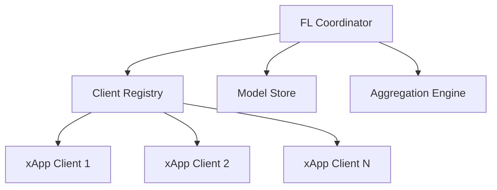

# Contributing to O-RAN Near-RT RIC

Thank you for your interest in contributing to the O-RAN Near-RT RIC platform! This document provides guidelines and best practices for contributing to our project.

## Table of Contents

- [Code of Conduct](#code-of-conduct)
- [Getting Started](#getting-started)
- [Development Environment](#development-environment)
- [Contributing Process](#contributing-process)
- [Coding Standards](#coding-standards)
- [Testing Guidelines](#testing-guidelines)
- [Documentation](#documentation)
- [Security Guidelines](#security-guidelines)
- [Community](#community)

## Code of Conduct

Please read and follow our [Code of Conduct](CODE_OF_CONDUCT.md). We are committed to providing a welcoming and inclusive environment for all contributors.

## Getting Started

### Prerequisites

Before contributing, ensure you have:

- **Git**: Version control system
- **Go**: Version 1.22 or later
- **Node.js**: Version 18 or later
- **Docker**: For containerization and testing
- **Kubernetes**: kubectl and access to a cluster (KIND for local development)
- **Make**: Build automation tool

### Development Tools

We recommend these tools for development:

- **IDE**: VS Code, GoLand, or similar with Go and TypeScript support
- **Go Tools**: golangci-lint, gofmt, go vet
- **Angular CLI**: Version 13.3.3 or later
- **Container Tools**: Docker Desktop or Podman

## Development Environment

### Local Setup

1. **Clone the Repository**
   ```bash
   git clone https://github.com/near-rt-ric/near-rt-ric.git
   cd near-rt-ric
   ```

2. **Set Up Go Environment**
   ```bash
   cd dashboard-master/dashboard-master
   go mod download
   go mod verify
   ```

3. **Set Up Node.js Environment**
   ```bash
   # Main dashboard
   cd dashboard-master/dashboard-master
   npm install
   
   # xApp dashboard
   cd ../../xAPP_dashboard-master
   npm install
   ```

4. **Set Up Kubernetes Cluster**
   ```bash
   # Using KIND for local development
   kind create cluster --config .github/kind-config.yaml
   kubectl cluster-info
   ```

### Running the Application

1. **Start Backend Services**
   ```bash
   cd dashboard-master/dashboard-master
   make run-backend
   ```

2. **Start Frontend Services**
   ```bash
   # Main dashboard
   npm start
   
   # xApp dashboard (in another terminal)
   cd xAPP_dashboard-master
   npm start
   ```

3. **Deploy to Kubernetes**
   ```bash
   make deploy
   ```

## Contributing Process

### 1. Issue Creation

Before starting work:

- **Search Existing Issues**: Check if similar issues exist
- **Create New Issue**: Use appropriate issue templates
- **Discuss Approach**: For major changes, discuss design first
- **Get Assignment**: Wait for maintainer assignment before starting

### 2. Fork and Branch

1. **Fork the Repository**
   - Click "Fork" on GitHub
   - Clone your fork locally

2. **Create Feature Branch**
   ```bash
   git checkout -b feature/your-feature-name
   # or
   git checkout -b fix/issue-number-description
   ```

### 3. Development Workflow

1. **Make Changes**
   - Follow coding standards
   - Write tests for new functionality
   - Update documentation as needed

2. **Commit Changes**
   ```bash
   git add .
   git commit -m "feat: add federated learning aggregation algorithm
   
   - Implement FedAvg aggregation strategy
   - Add support for weighted averaging
   - Include Byzantine fault tolerance
   
   Fixes #123"
   ```

3. **Push to Fork**
   ```bash
   git push origin feature/your-feature-name
   ```

### 4. Pull Request

1. **Create Pull Request**
   - Use the PR template
   - Link related issues
   - Provide clear description
   - Add appropriate labels

2. **Review Process**
   - Address review feedback
   - Update documentation
   - Ensure CI passes

3. **Merge**
   - Squash commits if requested
   - Use conventional commit messages

## Coding Standards

### Go Code Standards

1. **Formatting**
   ```bash
   # Format code
   gofmt -w .
   
   # Run linter
   golangci-lint run
   ```

2. **Naming Conventions**
   - Use camelCase for variables and functions
   - Use PascalCase for exported types and functions
   - Use meaningful, descriptive names
   - Follow Go naming conventions

3. **Code Structure**
   ```go
   // Package comment
   package federatedlearning
   
   import (
       // Standard library first
       "context"
       "fmt"
       
       // Third-party packages
       "github.com/go-redis/redis/v8"
       
       // Local packages
       "github.com/hctsai1006/near-rt-ric/types"
   )
   
   // Type definitions
   type Coordinator struct {
       // fields...
   }
   
   // Constructor
   func NewCoordinator() *Coordinator {
       // implementation...
   }
   
   // Methods
   func (c *Coordinator) StartTraining(ctx context.Context) error {
       // implementation...
   }
   ```

4. **Error Handling**
   ```go
   // Always handle errors explicitly
   if err != nil {
       return fmt.Errorf("failed to start training: %w", err)
   }
   
   // Use custom error types when appropriate
   type TrainingError struct {
       JobID string
       Cause error
   }
   
   func (e *TrainingError) Error() string {
       return fmt.Sprintf("training failed for job %s: %v", e.JobID, e.Cause)
   }
   ```

### TypeScript/Angular Standards

1. **Formatting**
   ```bash
   # Format code
   npm run lint
   npm run lint:fix
   ```

2. **Naming Conventions**
   - Use camelCase for variables and functions
   - Use PascalCase for classes and interfaces
   - Use kebab-case for file names
   - Use UPPER_CASE for constants

3. **Component Structure**
   ```typescript
   // my-component.component.ts
   import { Component, OnInit, OnDestroy } from '@angular/core';
   import { Subject } from 'rxjs';
   import { takeUntil } from 'rxjs/operators';
   
   @Component({
     selector: 'app-my-component',
     templateUrl: './my-component.component.html',
     styleUrls: ['./my-component.component.scss']
   })
   export class MyComponent implements OnInit, OnDestroy {
     private destroy$ = new Subject<void>();
     
     ngOnInit(): void {
       // Initialization logic
     }
     
     ngOnDestroy(): void {
       this.destroy$.next();
       this.destroy$.complete();
     }
   }
   ```

4. **Type Safety**
   ```typescript
   // Use interfaces for type definitions
   interface FLClient {
     id: string;
     name: string;
     status: ClientStatus;
   }
   
   // Use enums for constants
   enum ClientStatus {
     REGISTERED = 'registered',
     TRAINING = 'training',
     OFFLINE = 'offline'
   }
   
   // Use strict typing
   function updateClient(client: FLClient): Observable<FLClient> {
     return this.http.put<FLClient>(`/api/clients/${client.id}`, client);
   }
   ```

## Testing Guidelines

### Unit Testing

1. **Go Tests**
   ```go
   func TestCoordinator_StartTraining(t *testing.T) {
       ctx := context.Background()
       coordinator := NewCoordinator()
       
       err := coordinator.StartTraining(ctx)
       
       assert.NoError(t, err)
       assert.Equal(t, TrainingStatusRunning, coordinator.Status())
   }
   
   func TestCoordinator_StartTraining_WithInvalidConfig(t *testing.T) {
       ctx := context.Background()
       coordinator := NewCoordinator()
       coordinator.config = nil // Invalid config
       
       err := coordinator.StartTraining(ctx)
       
       assert.Error(t, err)
       assert.Contains(t, err.Error(), "invalid configuration")
   }
   ```

2. **Angular Tests**
   ```typescript
   describe('MyComponent', () => {
     let component: MyComponent;
     let fixture: ComponentFixture<MyComponent>;
     let service: jasmine.SpyObj<MyService>;
   
     beforeEach(() => {
       const spy = jasmine.createSpyObj('MyService', ['getData']);
   
       TestBed.configureTestingModule({
         declarations: [MyComponent],
         providers: [{ provide: MyService, useValue: spy }]
       });
   
       fixture = TestBed.createComponent(MyComponent);
       component = fixture.componentInstance;
       service = TestBed.inject(MyService) as jasmine.SpyObj<MyService>;
     });
   
     it('should create', () => {
       expect(component).toBeTruthy();
     });
   
     it('should load data on init', () => {
       const testData = [{ id: 1, name: 'test' }];
       service.getData.and.returnValue(of(testData));
   
       component.ngOnInit();
   
       expect(service.getData).toHaveBeenCalled();
       expect(component.data).toEqual(testData);
     });
   });
   ```

### Integration Testing

1. **API Tests**
   ```go
   func TestFLCoordinatorAPI(t *testing.T) {
       // Set up test server
       server := httptest.NewServer(handler)
       defer server.Close()
       
       // Test registration endpoint
       client := &http.Client{}
       req, _ := http.NewRequest("POST", server.URL+"/api/fl/register", strings.NewReader(`{"id":"test-client"}`))
       resp, err := client.Do(req)
       
       assert.NoError(t, err)
       assert.Equal(t, http.StatusOK, resp.StatusCode)
   }
   ```

2. **E2E Tests**
   ```typescript
   // cypress/integration/fl-workflow.spec.ts
   describe('Federated Learning Workflow', () => {
     it('should complete training round', () => {
       cy.visit('/fl-dashboard');
       cy.get('[data-cy=start-training]').click();
       cy.get('[data-cy=training-status]').should('contain', 'Running');
       cy.get('[data-cy=round-progress]').should('be.visible');
     });
   });
   ```

### Test Coverage

- **Minimum Coverage**: 80% for new code
- **Critical Paths**: 95% coverage required
- **Run Tests**: `make test` or `npm test`
- **Coverage Report**: Generated automatically in CI

## Documentation

### Code Documentation

1. **Go Documentation**
   ```go
   // Package federatedlearning implements the federated learning coordination
   // for the O-RAN Near-RT RIC platform. It provides secure, privacy-preserving
   // machine learning capabilities across distributed xApps.
   package federatedlearning
   
   // Coordinator manages federated learning training rounds and client coordination.
   // It implements the FL protocol with support for various aggregation algorithms
   // and privacy mechanisms.
   type Coordinator struct {
       // config holds the coordinator configuration
       config *CoordinatorConfig
       // clients maintains the registry of connected FL clients
       clients map[string]*FLClient
   }
   
   // StartTraining initiates a new federated learning training round.
   // It validates client availability, initializes the global model,
   // and begins the training process.
   //
   // Parameters:
   //   ctx: Context for request cancellation and timeouts
   //   job: Training job configuration
   //
   // Returns:
   //   error: Any error encountered during training startup
   func (c *Coordinator) StartTraining(ctx context.Context, job *TrainingJob) error {
       // implementation...
   }
   ```

2. **TypeScript Documentation**
   ```typescript
   /**
    * Service for managing federated learning client operations.
    * Provides methods for client registration, status monitoring,
    * and training coordination.
    */
   @Injectable({
     providedIn: 'root'
   })
   export class FLClientService {
     /**
      * Registers a new federated learning client.
      * @param client - Client configuration and metadata
      * @returns Observable of the registered client
      */
     registerClient(client: FLClientConfig): Observable<FLClient> {
       // implementation...
     }
   }
   ```

### Architecture Documentation

Update the following when making architectural changes:

- **README.md**: High-level system overview
- **Architecture Diagrams**: Use Mermaid or PlantUML
- **API Documentation**: OpenAPI/Swagger specs
- **Deployment Guides**: Kubernetes and Docker Compose

### Example Documentation Updates

```markdown
## Federated Learning Architecture



The FL Coordinator manages the federated learning process by:
1. Maintaining client registry
2. Coordinating training rounds
3. Aggregating model updates
4. Ensuring privacy preservation
```

## Security Guidelines

### Secure Coding Practices

1. **Input Validation**
   ```go
   func (c *Coordinator) RegisterClient(req *RegisterRequest) error {
       // Validate required fields
       if req.ClientID == "" {
           return errors.New("client ID is required")
       }
       
       // Validate format
       if !isValidClientID(req.ClientID) {
           return errors.New("invalid client ID format")
       }
       
       // Sanitize inputs
       req.ClientID = sanitize(req.ClientID)
       
       // Continue with registration...
   }
   ```

2. **Authentication and Authorization**
   ```go
   func (c *Coordinator) authenticateClient(ctx context.Context, clientID string) error {
       token, ok := extractToken(ctx)
       if !ok {
           return errors.New("authentication required")
       }
       
       if !c.validateToken(token, clientID) {
           return errors.New("invalid authentication")
       }
       
       return nil
   }
   ```

3. **Secrets Management**
   ```go
   // Never hardcode secrets
   // ❌ Bad
   const dbPassword = "supersecret123"
   
   // ✅ Good
   dbPassword := os.Getenv("DB_PASSWORD")
   if dbPassword == "" {
       return errors.New("DB_PASSWORD environment variable required")
   }
   ```

### Security Testing

1. **Run Security Scans**
   ```bash
   # Dependency scanning
   npm audit
   go list -json -deps ./... | nancy sleuth
   
   # Static analysis
   gosec ./...
   npm run lint:security
   
   # Container scanning
   trivy image your-image:tag
   ```

2. **Security Review Checklist**
   - [ ] Input validation implemented
   - [ ] Authentication/authorization checked
   - [ ] Secrets properly managed
   - [ ] Error handling secure
   - [ ] Logging doesn't expose sensitive data
   - [ ] Dependencies up to date
   - [ ] Security tests written

## Community

### Communication Channels

- **GitHub Issues**: Bug reports and feature requests
- **GitHub Discussions**: General questions and ideas
- **Slack**: [Join our workspace](https://oran-nearrt-ric.slack.com)
- **Mailing List**: dev@oran-nearrt-ric.org
- **Monthly Meetings**: First Tuesday of each month

### Getting Help

1. **Documentation**: Check README and wiki first
2. **Search Issues**: Look for existing solutions
3. **Ask Questions**: Use GitHub Discussions
4. **Join Community**: Slack for real-time help

### Recognition

We recognize contributors through:

- **Contributor List**: All contributors listed in README
- **Release Notes**: Major contributions highlighted
- **Community Awards**: Monthly recognition program
- **Conference Presentations**: Speaking opportunities

## Release Process

### Version Scheme

We follow [Semantic Versioning](https://semver.org/):

- **MAJOR**: Breaking changes
- **MINOR**: New features (backward compatible)
- **PATCH**: Bug fixes (backward compatible)

### Release Schedule

- **Major Releases**: Quarterly
- **Minor Releases**: Monthly
- **Patch Releases**: As needed for critical fixes

### Release Checklist

- [ ] All tests passing
- [ ] Documentation updated
- [ ] Security scan completed
- [ ] Performance benchmarks validated
- [ ] Backward compatibility verified
- [ ] Release notes prepared

## Questions?

If you have any questions about contributing, please:

1. Check existing documentation
2. Search GitHub issues
3. Ask in GitHub Discussions
4. Join our Slack workspace
5. Email the maintainers: maintainers@oran-nearrt-ric.org

Thank you for contributing to the O-RAN Near-RT RIC platform!